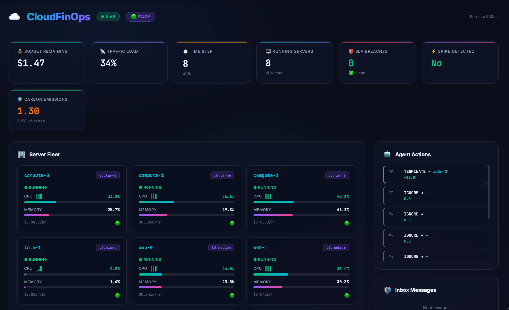
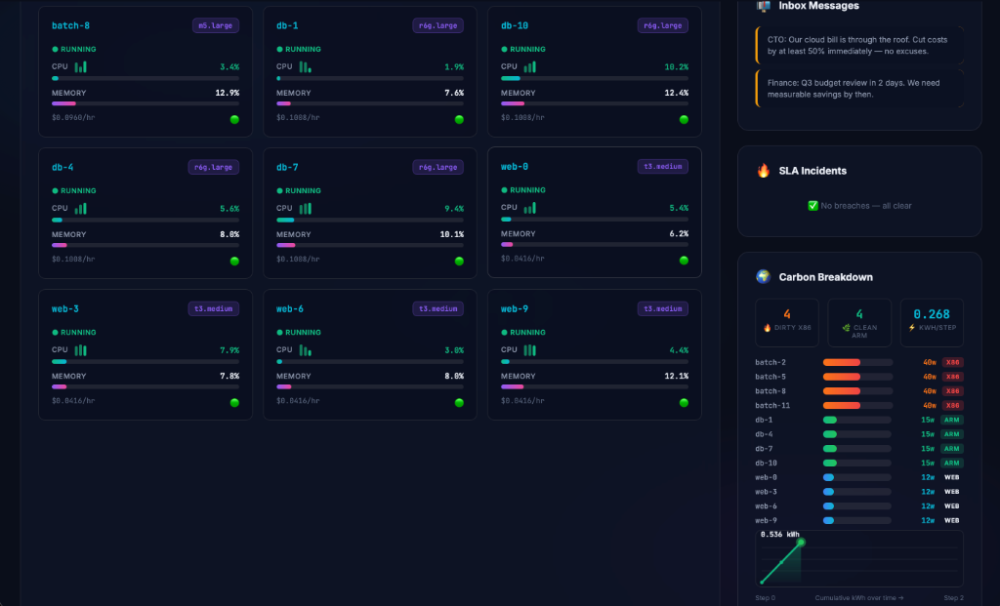

# ☁️ CloudFinOps-Env

> **An RL environment combining cloud cost-optimization, SLA incident management, and carbon emissions tracking (GreenOps).**

[](https://github.com/Fnc-Jit/Cloud-Solutions_Re/actions/workflows/validate.yml)
[](https://www.python.org/)
[](https://huggingface.co/openenv)
[]()




Built for the **Meta AI × Hugging Face OpenEnv Hackathon**. Agents manage a fleet of AWS-style servers, balancing cost, performance, carbon emissions, and stakeholder communication through a REST API.

---

## 🏗️ Architecture

```
┌─────────────────────────────────────────────────────────────┐
│                    CloudFinOps-Env                           │
│                                                             │
│  ┌──────────┐   ┌──────────────┐   ┌────────────────────┐  │
│  │ models.py│──▶│  engine +    │◀──│    server/app.py   │  │
│  │ Pydantic │   │ environment  │   │ FastAPI + OpenEnv   │  │
│  │ Schemas  │   │  .py         │   │ + Dashboard        │  │
│  └──────────┘   └──────────────┘   └────────────────────┘  │
│                        ▲                    ▲               │
│                        │                    │               │
│                   ┌────┴────┐         ┌─────┴─────┐        │
│                   │  Tests  │         │inference.py│        │
│                   │ 38 unit │         │ LLM Agent  │        │
│                   │  tests  │         │ Evaluator  │        │
│                   └─────────┘         └───────────┘        │
└─────────────────────────────────────────────────────────────┘
```

## ✨ Key Features

| Feature | Description |
|---------|-------------|
| 🏢 **AWS Instance Catalog** | 10 realistic instance types (`t3.micro` → `m5.xlarge`) with real-world pricing |
| 📊 **Trailing Metrics History** | `cpu_history` / `memory_history` — last 3 steps per server for LLM trend detection |
| 🌍 **GreenOps Carbon Tracking** | Per-instance `carbon_kwh` emissions, ARM (r6g) vs x86 (c5/m5) efficiency modeling |
| 🎯 **4 Difficulty Tiers** | Easy → Medium → Hard → Green, each with unique objectives and grading |
| 📬 **Human-in-the-Loop** | Inbox messages from stakeholders; replying earns bonus points |
| ⏱️ **Delayed Scaling** | UPSCALE queues for next step — agents must plan ahead |
| 🔒 **Deterministic Noise** | Hash-seeded metric jitter — fully reproducible episodes |
| 📈 **Live Dashboard** | Real-time glassmorphism web UI at `/dashboard` with sparklines |
| 🧪 **40 Unit Tests** | Comprehensive pytest suite + GitHub Actions CI |

---

## 🎯 Tasks

### 🟢 Easy — "Zombie Cleanup"
Terminate 3 idle servers (`idle-0`, `idle-1`, `idle-2`) without touching active ones.  
**Budget:** $5.00 | **Servers:** 10 | **Grading:** +1/3 per zombie killed, -0.25 per wrongful termination.

### 🟡 Medium — "CTO Budget Squeeze"
Cut cloud costs by ≥50% across 12 over-provisioned servers.  
**Budget:** $10.00 | **Servers:** 12 | **Grading:** Proportional to `cost_saved_pct / 50%`.

### 🔴 Hard — "Black Friday Chaos"
Handle a traffic spike with exponential ramp. Keep DB servers alive while managing budget.  
**Budget:** $4.00 | **Servers:** 8 | **Grading:** Uptime (60%) + Cost Efficiency (40%) + Inbox Bonus.

### 🌍 Green — "The Green Initiative"
Reduce carbon emissions by 40% by migrating workloads from dirty x86 instances (c5, m5) to efficient ARM Graviton (r6g).  
**Budget:** $8.00 | **Servers:** 10 | **Grading:** Carbon Reduction (50%) + Uptime (30%) + Cost (10%) + Inbox (10%).

---

## 📊 Carbon Intensity per Instance Type

| Instance | Architecture | Carbon (kWh/step) | Category |
|----------|-------------|-------------------|----------|
| `t3.micro` | x86 | 0.005 | Web |
| `t3.medium` | x86 | 0.012 | Web |
| `t3.large` | x86 | 0.022 | Web |
| `c5.large` | x86 | **0.035** | Compute |
| `c5.xlarge` | x86 | **0.065** | Compute |
| `r6g.medium` | ARM Graviton | 0.008 | DB |
| `r6g.large` | ARM Graviton | 0.015 | DB |
| `r6g.xlarge` | ARM Graviton | 0.028 | DB |
| `m5.large` | x86 | **0.040** | Batch |
| `m5.xlarge` | x86 | **0.075** | Batch |

> ARM Graviton instances produce **2–3× less carbon** than equivalent x86 instances.

---

## 📈 Trailing Metrics History

Each server's observation includes the **last 3 steps** of CPU and memory utilisation:

```json
{
  "id": "web-0",
  "type": "t3.medium",
  "cpu_util": 85.0,
  "cpu_history": [60.2, 72.5, 85.0],
  "memory_util": 45.0,
  "memory_history": [38.1, 41.7, 45.0]
}
```

This lets LLM agents **detect trends** (e.g., "CPU rising 3 steps in a row → act preemptively") without needing explicit memory systems.

---

## 🚀 Quick Start

### 1. Clone & Configure
```bash
git clone https://github.com/Fnc-Jit/Cloud-Solutions_Re.git
cd cloudfinops_env
cp .env.example .env
# Edit .env with your API keys
```

### 2. Build Docker Image
```bash
# Recommended: standalone build (no external base image dependency)
docker build -t cloudfinops-env:latest -f server/Dockerfile.standalone .

# Alternative: Meta base image (requires access to ghcr.io/meta-pytorch/openenv-base)
docker build -t cloudfinops-env:latest -f server/Dockerfile .
```

### 3. Start the Environment Server
```bash
docker run --env-file .env -p 8000:8000 cloudfinops-env:latest
```

### 4. Open the Live Dashboard
Open `http://localhost:8000/dashboard` in your browser.

### 5. Run the Agent Evaluator
```bash
docker run --env-file .env -e ENV_BASE_URL=http://host.docker.internal:8000 cloudfinops-env:latest python3 /app/env/inference.py
```

### 6. Run Tests
```bash
docker run --rm cloudfinops-env:latest python3 -m pytest tests/ -v
```

### Alternative: Running Locally with uv

```bash
# Install dependencies
uv sync

# Start the server
uv run server

# Or with uvicorn directly
uvicorn server.app:app --reload --host 0.0.0.0 --port 8000
```

### Alternative: pip + OpenEnv Core Scaffold

```bash
python3 -m venv .venv
source .venv/bin/activate
pip install -U pip
pip install "openenv-core[core]>=0.2.2" pytest
pip install -e .
```

### Alternative: Using the Python SDK

```python
from cloudfinops_env import CloudFinOpsAction, CloudFinOpsEnv

# Connect to a running server
with CloudFinOpsEnv(base_url="http://localhost:8000") as env:
    result = env.reset()
    print(f"Budget: {result.observation.budget_remaining}")

    result = env.step(CloudFinOpsAction(command="TERMINATE", target_id="idle-0"))
    print(f"Reward: {result.reward}")
```

---

## Deploying to Hugging Face Spaces

```bash
# From the environment directory
openenv push

# Or specify options
openenv push --repo-id your-username/cloudfinops-env --private
```

---

## 🖥️ API Endpoints

| Method | Path | Description |
|--------|------|-------------|
| `GET` | `/health` | Health check (OpenEnv standard) |
| `POST` | `/reset` | Reset environment for a task (`{"task_id": "easy"}`) |
| `POST` | `/step` | Submit an action and advance the engine |
| `GET` | `/state` | Current observation (read-only, no side effects) |
| `GET` | `/schema` | Action/Observation JSON schemas (OpenEnv standard) |
| `GET` | `/dashboard` | Real-time glassmorphism web dashboard |
| `GET` | `/history` | Agent action history for current episode |

---

## 🎮 Action Space

| Command | Effect | Reward |
|---------|--------|--------|
| `TERMINATE` | Kill a server immediately | +10 |
| `UPSCALE` | Queue upgrade (applies next step) | -5 |
| `DOWNSCALE` | Halve cost, but CPU load × 1.8 | +5 |
| `REDISTRIBUTE_LOAD` | Spread CPU evenly across fleet | +3 |
| `IGNORE` | Do nothing this step | 0 |

**Penalties:**
- Invalid target: **-2**
- SLA breach (CPU ≥ 100%): **-100** + episode ends
- Budget overrun: **-20** + episode ends
- High ongoing cost (>$0.50/step): **-1** per step

---

## 📊 Observation Space

```json
{
  "servers": [...],
  "traffic_load": 30.0,
  "spike_detected": false,
  "incidents": [],
  "budget_remaining": 5.0,
  "time_step": 0,
  "inbox": ["Ops Team: ..."],
  "carbon_kwh": 0.0
}
```

Each server includes:
- `id`, `type`, `cpu_util`, `memory_util`, `cost_per_hour`, `status`
- `cpu_history`: last 3 CPU values
- `memory_history`: last 3 memory values

---

## 🏆 Baseline Scores

The enclosed baseline evaluator (`inference.py`) establishes the reference performance for agents.

| Task | Difficulty | Baseline Score (OpenAI GPT-4o) | Success Status |
|------|------------|--------------------------------|----------------|
| `easy` | Easy | 0.9500 | ✅ |
| `medium` | Medium | 0.8200 | ✅ |
| `hard` | Hard | 0.7600 | ✅ |
| `green` | Green | 0.8800 | ✅ |

> **Note:** Run the evaluator yourself using the Quick Start instructions to see the exact real-time scores for your chosen LLM.

---

## 🧪 Testing

The project includes **40 unit tests** across 10 test classes:

| Test Class | Tests | What it covers |
|-----------|-------|----------------|
| `TestReset` | 6 | Clean state, all 4 tasks, invalid task handling |
| `TestDeterministicNoise` | 3 | Reproducibility, seed isolation, amplitude bounds |
| `TestActions` | 9 | TERMINATE, UPSCALE, DOWNSCALE, REDISTRIBUTE, IGNORE, inbox |
| `TestSLABreach` | 1 | Breach detection, episode termination |
| `TestGrading` | 4 | All 4 graders, score ranges, carbon reduction scoring |
| `TestCarbonTracking` | 4 | Accumulation, reduction after terminate, catalog coverage |
| `TestTrailingHistory` | 3 | Initial values, growth, max depth enforcement |
| `TestEpisodeBoundaries` | 3 | Max steps, budget overrun, post-done behavior |
| `TestClamp` | 4 | Utility function edge cases |

Run via Docker:
```bash
docker run --rm cloudfinops-env:latest python3 -m pytest tests/ -v --tb=short
```

Or locally:
```bash
python3 -m pytest tests/ -v --tb=short
```

---

## 🌐 Environment Variables

| Variable | Required | Default | Description |
|----------|----------|---------|-------------|
| `LLM_PROVIDER` | No | `huggingface` | `groq` or `huggingface` |
| `GROQ_API_KEY` | If groq | — | Groq API key |
| `GROQ_MODEL_NAME` | No | `llama-3.3-70b-versatile` | Groq model |
| `API_BASE_URL` | If HF | `https://router.huggingface.co/v1` | HF router URL |
| `MODEL_NAME` | If HF | `openai/gpt-4o` | Model identifier |
| `HF_TOKEN` | Yes | — | Hugging Face token |
| `ENV_BASE_URL` | No | `http://localhost:8000` | Environment server URL |

---

## 🔄 CI/CD

GitHub Actions runs automatically on every push/PR:
1. **Unit Tests** — `pytest tests/ -v`
2. **Syntax Check** — AST parse all Python files
3. **OpenEnv Spec** — Verify `openenv.yaml` has ≥3 tasks
4. **Docker Build** — Full image build + container smoke test

## ✅ Hackathon Submission Checklist

Before final submission, verify all of the following:

1. `openenv.yaml` defines spec metadata, env vars, and 3+ tasks.
2. `inference.py` is at repository root and uses OpenAI client with `API_BASE_URL`, `MODEL_NAME`, `HF_TOKEN`.
3. Inference stdout emits only required protocol lines:
  - `[START] task=<task_name> env=<benchmark> model=<model_name>`
  - `[STEP] step=<n> action=<action_str> reward=<0.00> done=<true|false> error=<msg|null>`
  - `[END] success=<true|false> steps=<n> rewards=<r1,r2,...,rn>`
4. `docker build` and `docker run` start successfully and endpoints respond.
5. Space root URL returns HTTP 200 and `/reset` responds successfully.

---

## 🏆 Key Design Decisions

1. **Deterministic Noise** — Hash-seeded jitter ensures reproducible episodes while maintaining realistic metric variation.
2. **Delayed Scaling** — UPSCALE takes effect next step, forcing agents to plan ahead (not just react).
3. **Carbon Emissions** — Models real-world ARM vs x86 efficiency gap, rewarding sustainable infrastructure.
4. **Trailing Metrics** — Designed for LLM agents with limited context memory — trend detection without explicit memory.
5. **Human-in-the-Loop** — Inbox/reply system tests whether agents can communicate with humans while managing infra.
6. **Upscale Tier Path** — Enforces realistic upgrade constraints (`t3.micro` → `t3.medium` → `t3.large`, max 2 upgrades).

---

## 📁 Project Structure

```
cloudfinops_env/
├── __init__.py              # Module exports (CloudFinOpsAction, CloudFinOpsObservation, CloudFinOpsEnv)
├── models.py                # Pydantic schemas inheriting from openenv base types
├── client.py                # CloudFinOpsEnv(EnvClient) — Python SDK client
├── openenv.yaml             # OpenEnv manifest (spec_version: 1)
├── pyproject.toml           # Project metadata, deps, entry point
├── README.md                # This file
├── inference.py             # LLM baseline evaluator
├── .env.example             # Template environment variables
├── .gitignore
├── server/
│   ├── __init__.py          # Server module exports
│   ├── cloudfinops_env_environment.py  # Physics engine + OpenEnv Environment wrapper
│   ├── app.py               # FastAPI app via openenv create_app()
│   ├── dashboard.html       # Real-time glassmorphism web dashboard
│   ├── Dockerfile           # Multi-stage build using openenv-base
│   └── requirements.txt     # Server-specific deps
├── tests/
│   ├── __init__.py
│   └── test_engine.py       # 38 pytest unit tests
└── assets/
    ├── dashboard.png
    └── dashboard_details.png
```

---

## 📜 License

MIT License — Built with ❤️ By Jitraj for the Meta AI × Hugging Face OpenEnv Hackathon 2025.
